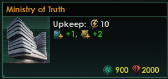
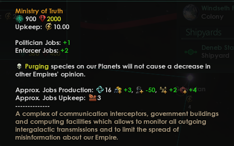
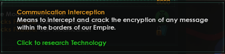

# Stellaris Neutral Purge Mod
Mod for Stellaris providing new technology and building to prevent opinion decrease from purging pops.
Adds new building and technology to prevent decrease in relationship when purging species.

Dependencies: None

Mod Conflicts: Don't know, but it doesn't alter any of the vanilla files

## New Building - Ministry of Truth.

Can be built on capital planet only.

Building prerequisites - research new technology (Communications Interception)

---

## New Technology - Communications Interception

Tier 2

Area - society

Prerequisites - Quantum Hacking (T1 Physics tech)

Xenophobe empires have 2x chance to pull that technology card

---

Currently, this mod is something I made for myself, but decided to share with others.